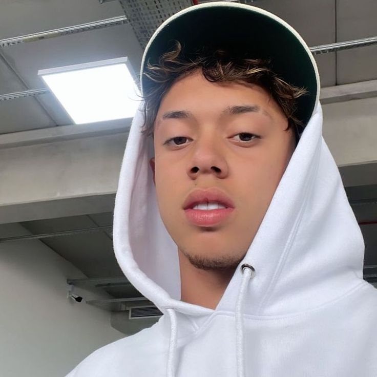

  
  

    

        <h1 style="margin: 0;">🧠 Iamthebestts</h1>
        
<strong><code>FullStack Developer & Web/UI/UX Designer</code></strong>

    

  

Eu sou um desenvolvedor full-stack e Web/UI/UX Designer, criando experiências digitais do zero. Cada projeto é uma jornada onde coloco paixão e propósito em cada linha de código e no design. Desde o planejamento até a implementação, sempre busco criar soluções que resolvem problemas reais, com interfaces intuitivas e sistemas robustos. Meu objetivo é criar experiências que sejam não apenas funcionais, mas também visualmente impactantes e eficientes.

---

### 🧰 Linguagens e Ferramentas

### IDEs

### Linguagens

### Tecnologías

#

### 📊 Status

